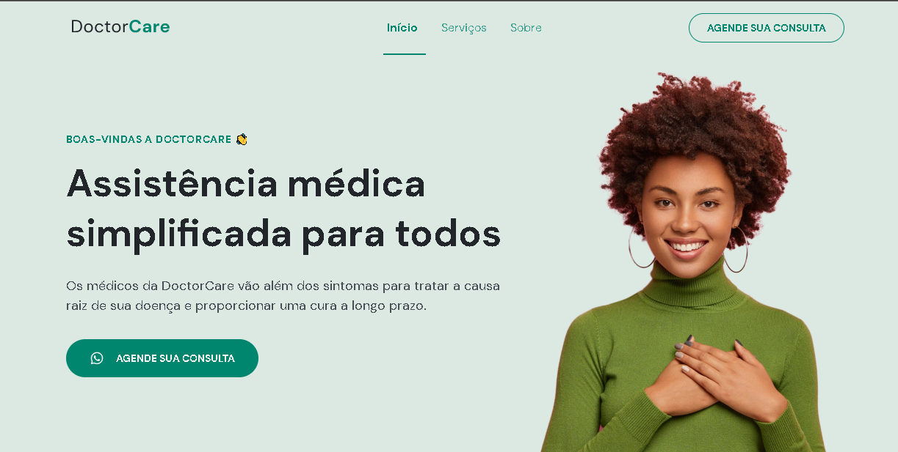
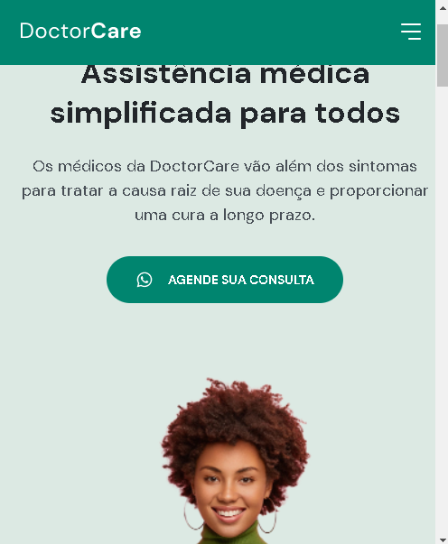
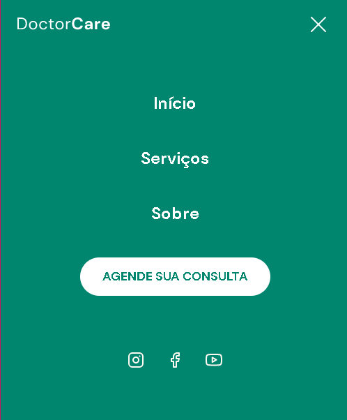

This is an one-page made at Next Level Week by Rocketseat.

## Table of contents

- [Overview](#overview)
  - The challenge is to build out this interactive hospital page.
- My process: It took me 5 days to build this.
  - Built with: HTML5, CSS3 and JAVASCRIPT.
  - What I learned: SPA and SSR concepts, css selector, the rem unity, boz-sizing, gaps, margin-inline/padding-inline, margin-block/padding-block, object-position, z-index, calc() concept, DOM, landing and one-page concepts, how to use a lib, how to use the WhatsApp API, width: fit-content, reset concepts,  display grid, innerHeight, offsetHeight, offsetTop.
  - Continued development: I have to continue practice HTML, CSS and JAVASCRIPT. 
  - Useful resources: https://www.figma.com/file/yCi38MDHoN5AnA71BtkjX9/DoctorCare-(Community)?node-id=1744%3A609

- Author: Natali Marinho. 
- Acknowledgments: javascript, css and html.


### The challenge

Users should be able to:

- View the optimal layout for the app depending on their device's screen size 
- See hover and active states for all interactive elements on the page
- See the interative subjects

### Screenshot






### Built with

- Semantic HTML5 markup
- CSS custom properties
- Flexbox
- CSS Grid
- Mobile-first workflow


### What I learned
```html
    <!-- ScrollReaveal Lib -->
    <script src="https://unpkg.com/scrollreveal"></script>
```
<a class="button" href="https:wa.me/557199616327" target="_blank"> 

```css
font-size: 62.5%; /* 1rem = 10px */
```
```css
gap: 1.6rem;
```

```css
padding-block: 0;
margin-block: 1.6rem;
margin-inline: auto;
padding-inline: 2.4rem;
```
```css
object-position: 0 2rem;
```
```css
z-index: 100;
```

```css
height: calc(76% + var(--nav-height));
```

```css
width: fit-content;
```


```css
* {
  margin: 0;
  padding: 0;
  box-sizing: border-box;
}

nav#navigation .wrapper * {
  margin: 0;
  padding: 0;
  visibility: initial;
  display: initial;
  opacity: initial;
  flex-direction: initial;
  position: initial;
  font-size: initial;
  transform: inherit;
  color: initial;
  background-color: initial;
  font-weight: initial;
  filter: initial;
}
```

```css
display: grid;
 grid-area: A;
```
```js
function saida(){
    let entr = document.getElementById("entrada")
    entr.style.display = "none"
      let saida = document.getElementById("greetings")
    saida.style.display = "flex"
//nota.innerHTML = `You selected ${rating} out of 5`
}
```

```js
navigation.classList.remove('scroll')
```
```js
  const targetLine = scrollY + innerHeight / 2 

  const sectionTop = section.offsetTop
  const sectionHeight = section.offsetHeight
```

### Useful resources

- [Rocketseat](https://youtube.com/c/RocketSeat) - The youtube channel of the NWL event. 

## Author

- Frontend Mentor - [@natsmarinho](https://www.frontendmentor.io/profile/natsmarinho)
- Twitter - [@friidakhalo](https://www.twitter.com/friidakhalo)
- Instagram - [@natsmarinho](https://www.instagram.com/natsmarinho/)

## Acknowledgments

I would like to thank you at Rockeseat for make this great event public and Mayk Brito for sharing your knowledges with future developers. It's a honor for participate, for sure I am developing for the next level. 